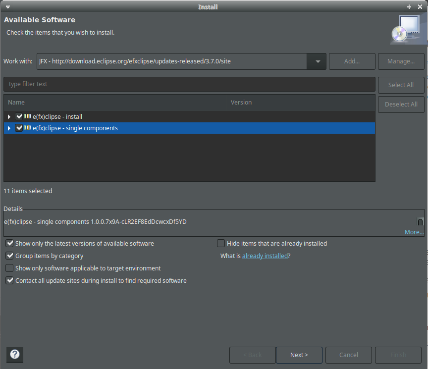

# learningjfx
Proyecto para aprender a programar GUI con JavaFX

## Instalación de los JDK (Java Development Kits)
### Java
#### Instalación de Java
```bash
sudo apt update
sudo apt install openjdk
```
#### Verificación de la instalación Java
```bash
java -version
```
#### Configuración de las variables de entorno
Primero se buscar el directorio de instalación de Java:
```bash
readlink -f $(which java)
```
A continuación se añaden las variables de entorno al final del fichero de
configuración personal `.bashrc`.
```bash
cat >> ~/.bashrc <<EOL
# Java HOME
export JAVA_HOME=/usr/lib/jvm/java-8-openjdk-amd64
export JRE_HOME=/usr/lib/jvm/java-8-openjdk-amd64/jre
EOL
```
Y se recarga la configuración para tenga efecto:
```bash
source ~/.bashrc
```
### Instalación de JavaFX (JFX)
#### Descargar la versión del paquete necesaria desde
[aquí](https://gluonhq.com/products/javafx/).

#### Descomprimir el paquete en la carpeta deseada
```bash
sudo unzip Descargas/openjfx-15.0.1_linux-x64_bin-sdk.zip  -d /usr/lib/
```
#### Configurar las variables de entorno
```bash
cat >> ~/.bashrc <<EOL
# JavaFX HOME
export JFX_HOME=/usr/lib/javafx-sdk-15.0.1
EOL
```

## Instalación del complemento e(fx)clipse para Eclipse
1. Añadir el repositorio del complemento:
Abrir Eclipse  `-> Help -> Install New Software -> Add...`
Y completar con el enlace a la carpeta más reciente del repositorio
http://download.eclipse.org/efxclipse/updates-released/


2. Seleccionar el repositorio recién añadido, filtrar por
'ec(fx)lipse' y seleccionar todos los paquetes.


3. Tras finalizar la instalación, reiniciar Eclipse.

## Creación de un nuevo proyecto JFX

1. Desde `File -> New -> Project`, filtrar por `javafx`.


2. Dar nombre al proyecto y pulsar `Next''.

3. Añadir las librerías de JavaFX al _classspath_ del proyecto:
- `Libraries -> Add Librairy -> User Library -> User Libraries -> New` y darle
nombre a la librería de usuario nueva.


- Después, añadir el directorio donde se encuentran las librerías del JFX:
`Add External JARs -> Seleccionar directorio -> Abrir`.
- `Apply and Close -> Seleccionar la librería recién creada -> Finish -> Finish`.


4. Abrir el proyecto nuevo y seleccionar la clase `Main.java -> Botón derecho -> Run As -> Java Application`.


Si todo ha ido bien, debería aparecer una ventana de prueba de JFX en blanco.
Si hay algún error en las clases del proyecto, seguramente se deberá a una
configuración incorrecta de las librerías y el _classpath_. En este caso,
guiarse por la información de resolución de problemas sugerida por Eclipse.
